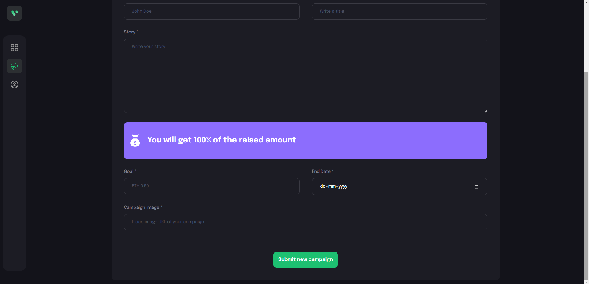

# [SocialCrypto](https://socialcrypto.netlify.app/) ⭐

&nbsp;
&nbsp;
&nbsp;
&nbsp;
&nbsp;<br/>
&nbsp;
&nbsp;


[](https://socialcrypto.netlify.app/)
[](https://github.com/ROHAN842/SocialCrypto)

## Overview 👀





- A crowdfunding platform with a vision to create a social impact 🤲
- Our unique model allows people from across the globe 🌍 to donate towards raising funds 💰 using cryptocurrency for products required by NGOs and charities in India, which are then delivered to them directly. 
- Clean UI ⚡

## What is Peer Coder? 🤔

#### A platform for do-gooders with a will to make a change in the world or at least in the lives of people who deserve better.


## How it works? 🤔
- **Open the website [https://socialcrypto.netlify.app/](https://socialcrypto.netlify.app/)**
- **As soon as the user will be opening our deployed website on their browser, they will be engaged with a vibrant, dynamic and attractive user interface where the user can easily access all the functionalities of our main page of the website such as WhyUs section, AboutUs section followed by ContactUs section.**
- **As soon as the user will clicking the Crowd Funding Button present on Navbar on the main web page of Social Crypto website, the Crowd Funding web page of the website will be opened, on which the user will be interacted with all the campaigns listed page where all the campaigns created by the each and every user are present in grid format.**


## Dependencies 🗃

- [React.js](https://reactjs.org/) - **Frontend Framework**
- [Node.js](https://nodejs.org/en/) - **Backend Framework**
- [Express.js](https://expressjs.com/) - **Server Side Node.js Framework**
- [ThirdWeb](https://portal.thirdweb.com/) - **Creating smart contracts using thirdweb sdk**
- [Metamask](https://metamask.io/) - **Metamask wallet integration in order to process fund transfer data in real time**

## Run Locally 💻

```
> Clone the repo
    >> For Windows: Git Bash
    >> For Linux: Terminal
    >> git clone https://github.com/ROHAN842/SocialCrypto.git
    >> cd SocialCrypto
> Install all dependencies
    >> npm i
> Spin the server on port 3000
    >> npm start
> Visit the website on http://localhost:3000/
    
```
